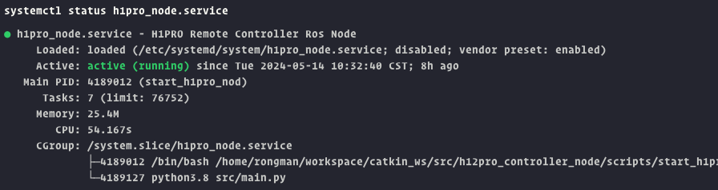
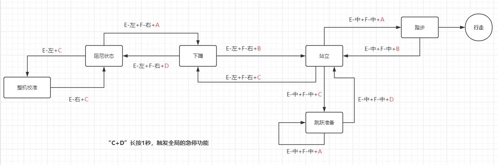

# H12Pro_Controller_Node

## 概述

仓库地址：https://www.lejuhub.com/highlydynamic/h12pro_controller_node

本仓库包括以下内容：

- H12Pro 控制器的底层SDK，用于接收 H12Pro 控制器的数据。
- H12Pro 通道数据发布的 ROS 节点，用于将 H12Pro 控制器的数据发布指定的 ROS 话题。
- H12Pro 控制器的控制器节点，用于接收 H12Pro 的 ROS 话题的数据，解析通道数据到指定按键组合，触发对应的按键事件，调用 Kuavo 中的 ROS 服务，实现对 Kuavo 的控制。
- RobotState 模块， 用于定义维护机器人的状态， 定义状态切换的规则， 以及状态切换时的回调函数。
- **H12Pro_Controller_Node仓库**中的配置文件:
  - `robot_state.json` 用于定义机器人的状态, 状态切换的规则, 以及状态切换时的回调函数名称。
  - `h12pro_remote_controller.json` 用于定义 H12Pro 各通道对应的按键名称， 以及不同状态下按键组合对应的事件名称等。
  - 修改配置文件后重新运行 H12Pro 控制器的控制器节点或者运行命令 `sudo systemctl restart h12pro_node.service` 即可使配置生效

## 使用方法

### 1. 创建工作空间

```bash
mkdir -p ~/catkin_ws/src
cd ~/catkin_ws/src
```

### 2. 获取代码

* 获取 H12Pro Controller Node 代码

```bash
git clone https://www.lejuhub.com/highlydynamic/h12pro_controller_node.git
```

* 获取 Kuavo 代码（如果没有）
  
```bash
git clone https://www.lejuhub.com/highlydynamic/kuavo_opensource.git
```

### 3. 检查 H12PRO 接收器的设备文件

将遥控器接收器插到机器人 USB 接口中，检查遥控器接收器的串口设备路径是否与文件 `lib/kuavo_remote/src/drivers_sbus.h` 中的 `SERIAL_DEVICE_PATH` 变量一致，若不一致，请自行修改。（默认为 `/dev/ttyUSB0`， 暂时需要手动修改，后续会添加串口设备规则）

### 4. 编译代码

```bash
cd ~/catkin_ws
catkin_make
```

### 5. 建立软链接

由于程序需要访问 `~/.config/lejuconfig`, 但是程序在 `root` 用户下中的运行,因此 `~/.config/lejuconfig` 与普通用户的不一致，所以需要在 `root` 用户下与 `/home/lab/.config/lejuconfig` 建立软链接。

```bash
sudo rm -rf /root/.config/lejuconfig
sudo ln -s /home/lab/.config/lejuconfig /root/.config/lejuconfig
sudo ls -l /root/.config
```

### 6. 运行程序

### 手动运行（Manual）

#### 6.1 运行 roscore

```bash
roscore
```

#### 6.2 运行 H12Pro 通道数据发布的 ROS 节点

检查 `catkin_ws` 工作空间路径， `cd ~/catkin_ws && pwd`， 将输出的路径设置为 `CATKIN_WS_PATH` 环境变量, 若 `catkin_ws` 空间不与文档所指定的路径相同，请自行设置环境变量为对应的路径。启动程序后，请尝试按下 H12Pro 控制器的按键或者摇杆，查看 ROS 话题 `/h12pro_channel` 是否有数据发布并且数据随之变化。

```bash
sudo su
export CATKIN_WS_PATH=/home/lab/catkin_ws
source $CATKIN_WS_PATH/devel/setup.bash
rosrun h12pro_controller_node h12pro_channel_publisher
```

#### 6.3 运行 H12Pro 控制器的控制器节点

设置 `CATKIN_WS_PATH` 环境变量。如果需要在真实的机器人中使用 H12Pro 控制器，请将启动程序时将 `--real` 参数传递（如下所示）， 若只在仿真环境，则不需要传递该参数。

```bash
sudo su
export CATKIN_WS_PATH=/home/lab/catkin_ws
source $CATKIN_WS_PATH/devel/setup.bash
cd $CATKIN_WS_PATH/src/h12pro_controller_node
python3 src/main.py --real
```

**请确保 `CATKIN_WS_PATH` 环境变量被设置正确, 否则程序将无法找到 `kuavo` 程序包。**

### 自动运行（Automatic）

#### 6.4 配置启动脚本

* 检查 catkin_ws 工作空间路径， `cd ~/catkin_ws && pwd`，将输出的路径复制到仓库目录中的启动脚本 `scripts/start_h12pro_channel_pub.sh` 和 `scripts/start_h12pro_node.sh` 中的 `CATKIN_WS_PATH` 环境变量。

* 检查仓库 `service` 目录中的 `h12pro_channel_pub.service` 与 `h12pro_node.service` 中的 `ExecStart` 是否与启动脚本的路径一致。

* 添加执行权限：

```bash
sudo chmod +x scripts/start_h12pro_channel_pub.sh
sudo chmod +x scripts/start_h12pro_node.sh
```

* 将 `services` 目录中的所有文件拷贝到 `/etc/systemd/system/` 目录下。

```bash
sudo cp ~/catkin_ws/src/h12pro_controller_node/services/* /etc/systemd/system/
```

* 刷新 systemd 服务

```bash
sudo systemctl daemon-reload
```

* 启动服务

```bash
sudo systemctl start roscore.service
sudo systemctl start h12pro_channel_pub.service
sudo systemctl start h12pro_node.service
```

* 停止服务

```bash
sudo systemctl stop roscore.service
sudo systemctl stop h12pro_channel_pub.service
sudo systemctl stop h12pro_node.service
```

* 设置开机自启

```bash
sudo systemctl enable roscore.service
sudo systemctl enable h12pro_channel_pub.service
sudo systemctl enable h12pro_node.service
```

* 取消开机自启

```bash
sudo systemctl disable roscore.service
sudo systemctl disable h12pro_channel_pub.service
sudo systemctl disable h12pro_node.service
```

* 查看服务状态

```bash
sudo systemctl status roscore.service
sudo systemctl status h12pro_channel_pub.service
sudo systemctl status h12pro_node.service
```

* 查看服务日志

```bash
sudo journalctl -u roscore.service
sudo journalctl -u h12pro_channel_pub.service
sudo journalctl -u h12pro_node.service
```

服务成功开启状态如图所示：

{:height="640px" width="480px"}

### 更新摇杆控制速度限制

在 `src/h12pro_node/h12pro_remote_controller.json` 中找到 `joystick_to_corresponding_axis` 字段，修改对应的摇杆通道对应的轴的速度限制，修改min和max值即可（min和max值要互为相反数）。

```json
{
  "joystick_to_corresponding_axis": {
    "left_joystick_vertical": {
      "axis":"x",
      "range":{
        "min":-0.6,
        "max":0.6
      }
    },
    "left_joystick_horizontal": {
      "axis":"y",
      "range":{
        "min":-0.2,
        "max":0.2
      }
    },
    "right_joystick_vertical": {
      "axis":"w",
      "range":{
        "min":-0.8,
        "max":0.8
      }
    }
  }
}
```

## 遥控器功能说明

### 按键说明

{:height="640px" width="480px"}

### 功能示意

{:height="640px" width="480px"}

## 配置文件说明

### robot_state.json

`robot_state.json` 文件用于定义机器人的状态, 状态切换的规则, 以及状态切换时的回调函数名称。

* 在 `states` 字段中定义机器人的状态。
* 在 `transitions` 字段中定义状态切换的规则，包括触发条件，源状态，目标状态，以及状态切换时的回调函数名称（回调函数的实现在 `robot_state/before_callback.py` 中)。
* 更多配置项请查看 `robot_state.json` 文件。  

示例：
```json
{
  "states":[
      "initial",
      "calibrate",
      "squat",
      "stand",
      "jump",
      "walk"
  ],
  "transitions": [
    {
      "trigger": "calibrate",
      "source": "initial",
      "dest": "calibrate",
      "before": "calibrate_callback"
    },
    ...
  ]
}
```

### h12pro_remote_controller.json

* `channel_to_key_name` 字段用于定义 H12Pro 遥控器各通道对应的按键名称( `1` 号 通道对应的为右摇杆水平方向)
* `channel_to_key_state` 字段用于定义通道数据不同状态下按键组合对应的事件名称(`E` 通道数据为 `282` 时对应的按键为 `E_LEFT`， `1002` 时对应的按键为 `E_MIDDLE`， `1722` 时对应的按键为 `E_RIGHT`)
* `robot_state_transition_keycombaination` 字段用于定义不同状态下对应的事件的按键组合(触发 `initial` 状态的 `start` 事件的按键组合为 `E_LEFT`, `F_RIGHT`, `A_PRESS`， 触发 `initial` 状态的 `calibrate` 事件的按键组合为 `E_LEFT`, `F_MIDDLE`, `C_PRESS`)
* `joystick_to_corresponding_axis` 字段用于定义摇杆通道对应控制机器人运动方向的轴，以及速度限制(`left_joystick_vertical` 通道对应的轴为 `x`， 速度限制为 `min: -0.6`, `max: 0.6`)
* 更多配置项请查看 `h12pro_remote_controller.json` 文件。

示例：
```json
{
  "channel_to_key_name": {
    "1": {
      "name": "right_joystick_horizontal",
      "type": "joystick"
    },
    ...
  },
  "channel_to_key_state": {
    "E": {
      "282": "E_LEFT",
      "1002": "E_MIDDLE",
      "1722": "E_RIGHT"
    },
    ...
  },
  "robot_state_transition_keycombaination": {
    "initial":{
      "start":["E_LEFT","F_RIGHT","A_PRESS"],
      "calibrate":["E_LEFT","F_MIDDLE","C_PRESS"]
    },
    ...
  },
  "joystick_to_corresponding_axis": {
    "left_joystick_vertical": {
      "axis":"x",
      "range":{
        "min":-0.6,
        "max":0.6
      }
    },
    ...
  }
}
