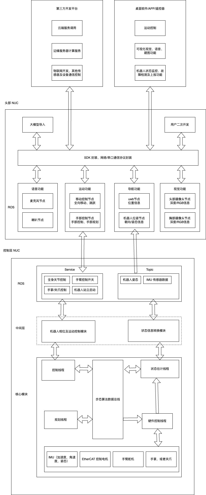
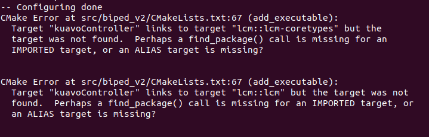
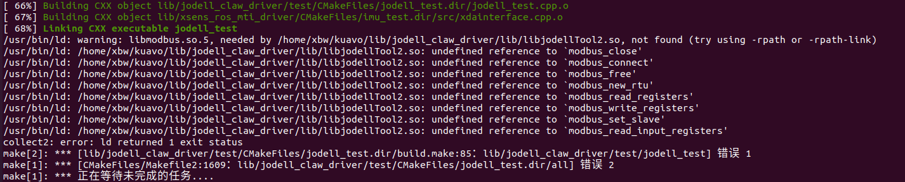
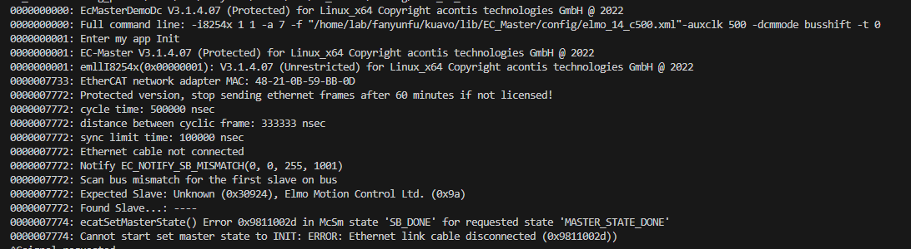
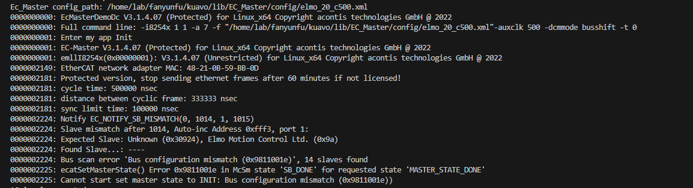
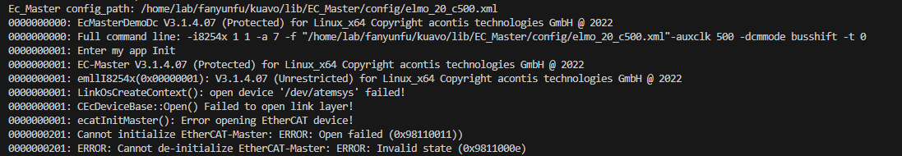
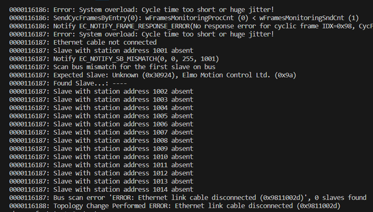
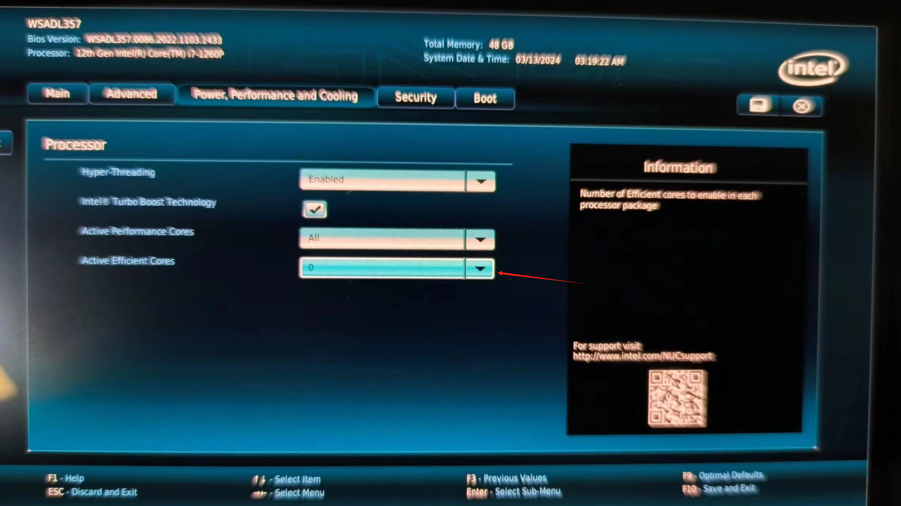

# 基本使用

## 使用示例代码

### 获取代码

1. Clone 代码：git clone https://gitee.com/leju-robot/kuavo_opensource 

### 确认环境变量中的机器人版本
- 我们的Kuavo实物机器人包含多个型号, 程序已经适配不同版本, 只需要在环境变量里面设置机器人版本即可。
- 确认机器人版本，在终端输入`echo $ROBOT_VERSION`, 输出版本号*10的整数, 如Kuavo2.3版本即为23，Kuavo3.2版本即为32以此类推。
- 如果没有设置机器人版本, 或者版本号和自己的机器人版本不对应，则根据以下流程设置。

        1. 根据使用的终端类型, 选择对应的配置文件。如bash终端, 编辑`~/.bashrc`；
        2. 添加`export ROBOT_VERSION=23`(Kuavo2.3版本即为23，Kuavo3.2版本即为32以此类推)到文件末尾, 保存并退出。
        3. 重新打开终端或者`source ~/.bashrc`, 重新编译代码即可生效。

### 编译代码

1. cd kuavo_opensource (如果使用了 git clone https://gitee.com/leju-robot/kuavo_opensource new_dir, 那么这里 cd 应该 cd 到 new_dir)
2. mkdir build 创建 cmake 需要的目录
3. cmake .. 使用 cmake 生成编译文件用的 Makefiles
4. make -j$(nproc) 这里是使用当前系统的 cpu 数，作为 make 编译并发的最大线程数
5. 如果编译错误，请使用 git status 查看是否改动过代码或者相关的第三方库
6. 如果编译成功，会在 ./src/biped_v2/kuavoController 产生一个执行文件


### 运行程序

编译仓库代码，会生成几个可执行文件

- ./src/biped_v2/kuavoController  控制程序，可以直接运行，控制机器人运动
- ./src/biped_v2/bin2csv 日志转换程序，将记录的log转换为csv格式，可在plotjuggler等工具中打开
- ./src/biped_v2/drake_play_back  回放程序，可以回放之前的log

#### 参数说明
`kuavoController`程序包含众多参数，可以通过--help查看参数用法，常见的比如：

- --real  运行在真实机器人上，实物上需要使用root权限运行
- --cali  校准模式(只在实物上使用)，运行校准模式，机器人全身电机回零，用于观察零位是否正确
- --log_lcm  开启lcm日志记录，默认关闭，开启之后会将每个时刻(精确到0.1ms)所有状态量记录到一个`lcm_log.bin`中，通过bin2csv可以转换为csv格式

`bin2csv`程序允许传入需要转换的二进制日志文件的路径，和输出的csv文件名。
- 不指定参数时，默认使用最近运行`kuavoController`保存到`/tmp/lcm_log.bin`的日志文件。
- 每次运行所有日志会保存到`/var/lcm_log/`目录下，以时间戳命名。

#### 仿真运行

仿真环境基于drake运行, 请参考以下步骤, 如果想用 docker 来运行 Drake, 可以参考 [docs/kuaovo_docker_env.md](docs/kuaovo_docker_env.md)

1. drake-visualizer 启动 drake 的前端环境

2. 执行机器人程序: `sudo ./src/biped_v2/kuavoController`

#### 按键说明:
- 在站立状态下才可以切换到行走、跳跃、下蹲等动作模式
    - 按下 r 键, 进入行走状态
    - 按下 j 键, 进入跳跃状态
    - 按下 p 键, 进入下蹲状态
    - 按下 h 和 k 键, 控制手爪开合(需要实物支持)
    - 按下数字键 1,2,3..., 执行对应配置文件(src/biped_v2/config/<ROBOT_VERSION>/pose.csv)中的第n个动作
- 走路状态下
    - 默认进入行走时是速度控制模式, 机器人进行原地踏步
    - 按 w,a,s,d 控制机器人前后左右移动, 
    - q,e 控制机器人左右旋转
    - 正在移动时, 按空格键, 机器人速度归零
    - 按下 c 键, 退出走路状态, 回到站立状态
- 跳跃状态下
    - 进入跳跃状态，机器人会先缓慢下蹲，等待下蹲到不动时才能进行起跳
    - 按下空格键或者 j 键, 起跳
    - 机器人会自动跳跃、落地，等待机器人站稳，可以再次按下空格键或者 j 键, 起跳
    - 按下 c 键或 q 键, 退出跳跃状态, 回到站立状态
- 其他状态下
    - 按下 c 键或者 q 键, 退出当前状态，回到站立状态
  
#### 实物运行
##### 校正机器人的电机位置

> 由于目前电机的单编码器装在电机高速端，还无法记住关节的绝对位置，所以每次电机断电之后重启，都需要先校准电机位置，让其落于此前记录零点位置时的那一圈里面, 之后就可以正常使用机器人了。

1. 将机器人拉离地面，并将所有的关节掰动的起始的位置，给机器人 NUC 和电机上电
2. 执行 sudo ./src/biped_v2/kuavoController --real --cali ，此时等待 EtherCat 通信自检。如果自检通过，机器人的电机会执行到起始的位置。如果观察到起始的位置不正确，只需要关闭电机总开关，调整每个电机的位置，再上电，保持 NUC 开机。再执行一遍 sudo ./src/biped_v2/kuavoController --real --cali。
4. 持续以上的循环，直到机器人在启动校正程序之后初始位置运动到正常的位置。
5. 校正完成之后机器人的电机会记住当前校正的位置，用户在电机关机之前都可以反复运行控制程序，不需要再次进行校正。
6. 如果确实无法调过上电位置将机器人初始位置校直，必要时可以调过调整机器人零点的方式将机器人状态调整到正确的位置, (注意机器人出厂已经调好零点，除非进行了电机的拆装，正常情况下不需要重新校准零点位置，只需要确保上电时编码器记录的位置在记录零点的那一圈之内即可)。
   - 零点文件位于`~/.config/lejuconfig/offset.csv`中
   - 上电之前，将机器人掰至全身关节伸直，然后上电，执行上述校准程序，程序运行时会打印出各个电机的初始位置，将这些位置写入`~/.config/lejuconfig/offset.csv`中。
   - 零点位置也可以根据实际行走或者站立的情况，手动微调。

##### 使用示例程序

1. 执行 sudo ./src/biped_v2/kuavoController --real

以下是操作方法

 2.1 将机器人吊里地面，机器人垂直伸展之后脚底离地面 2CM 以上

 2.2 输入上面的命令，按下回车。此时机器人会控制所有电机运动到准备状态。机器人的腿会缩起。

 2.3 放下机器人，让机器人缩起之后的校正在距离地面 2CM 左右的地方

 2.4 一人配合戴手套，拉住机器人的躯干，另一人按下 o 键，机器人会进入站立状态。站立的时候机器人会有一个向后倒的趋势，拉住机器人的人稍微用力，帮助机器人保持平衡。机器人平衡之后松手即可。

 2.5 机器人站立之后，按下 r 键，机器人会进入基于速度的步态模式，进入步态之后默认各个方向速度为0， 使用 a（左）d (右) w(前) d(后) 来改变在 x,y 轴上的速度，来控制机器人前后左右移动。机器人移动的时候吊起机器人的吊架需要同步移动，不能拉扯到机器人。
 
 2.6 退出步态模式为按下 c 键，此时机器人会重置移动速度，并退出步态模式，回复站立。（注意！此时不能直接使用 Ctrl+C 退出程序，否则机器人所有关节突然解除控制会产生比较大的惯性拉坏吊架的钢丝，导致机器人跌倒损坏）
 
 2.7 结束调试，按下 p 键，机器人会缩起双腿，使用吊架放下机器人，直到机器人缩起之后的脚底距离地面 2 CM 左右。 按下 Ctrl+C 退出程序。

##### 手臂舵机零点校正程序（如果重装系统，或者手臂的零点损坏可以按照以下的方法重新校正)

用来标定舵机的工作范围和记录当前的零点。如果运行的时候使用 --record 的参数，就会把最新的信息写入到零点配置文件中。 `~/.config/lejuconfig/servos_positions.ini`
如果不带 --record 参数就只会按照 1000ms 的间隔打印当前的舵机位置和读取到的最大和最小值

#### 执行手腕舵机标定程序

切换到仓库的根目录，比如 kuavo_opnesource。然后运行以下命令

```
sudo ./bin/start_tools.sh ./bin/dynamixel_calibrate_servos  --record
```

1. 把每个舵机都各自左右转动到限位的位置，并在限位的位置停留 2 秒。
2. 把每个舵机都转动到零点位置，停留 2 秒
3. 按 q 键，并回车等待校正程序退出。校正程序退出之后，在 `~/.config/lejuconfig/servos_positions.ini` 会记录每个舵机的零点和有效的运动范围。

2. 添加舵机设备的udev规则和自动设置latency_timer, 只需要在重装系统后添加，出厂的机器人已经添加过。

```
sudo cp 99-usb-servo.rules /etc/udev/rules.d/
sudo udevadm control --reload-rules
sudo udevadm trigger
```


# 代码说明

### 目录结构

```bash
./kuavo_opensource
├── build # 构建目录
│   
├── docs # 文档目录
│   └── ...
├── lcm # lcm消息定义目录
├── lib # 第三方库目录，以及存放编译出来的库文件
│   ├── DynamixelSDK # Dynamixel SDK
│   ├── EC_Master # EC-Master SDK
│   ├── jodell_claw_driver # 机械爪驱动
│   ├── Math # 常用的数学工具库
│   ├── motioncapture # 动捕sdk
│   ├── Predict_Fp # MPC预编译的库
│   ├── ruierman_controller # realman 驱动
│   └── xsens_ros_mti_driver # imu驱动
│       └── ...
├── models # 模型目录, 包含各个版本的机器人模型的 urdf 文件
│   ├── biped_gen2
│   ├── biped_gen2.3
│   ...
├── ros_package # ros包目录, 整个kuavo仓库可以作为一个ros包使用
│   ...
│ 
├── src # 源代码目录
│   ├── biped_v2
│   │   └── config # 配置文件目录， 包含各个版本机器人的配置文件，和 config.h 中定义的宏一致 
│   │       ├── kuavo_v2
│   │       ├── kuavo_v2.3
│   │       ├── kuavo_v3
│   │       ├── kuavo_v3.2
│   │       ├── kuavo_v3.3
│   │       └── kuavo_v3.4
│   ├── common # 公共代码目录，包含公用的一些文件，
│   │   ├── csv_player.h # csvlog播放，用于回放中从log中读取所有状态量
│   │   ├── csv_reader.h # csv读取器，读取配置文件，csv-log等
│   │   ├── forceDisturber.h
│   │   ├── FSMStatexxx.h # 状态机相关的定义，记录每个状态下调用的模块，可以根据需要增加状态机
│   │   ├── json.hpp # json解析库
│   │   ├── kalman_estimate.h # 状态估计中使用的卡尔曼滤波器
│   │   ├── Kalman.h # 卡尔曼滤波器
│   │   ├── lcm_logger.h # 日志库
│   │   ├── lcm_publish.h # log发布库
│   │   ├── RobotErrorTypes.h # 机器人错误类型定义
│   │   ├── robot_state.h # 机器人状态定义，定义了各个线程之间传递的状态量，需要详细理解
│   │   ├── robotStateStorage.h # 机器人状态存储器，用于存储最近一段时间的机器人状态量，各个线程从这里进行引用调用，用于后续的控制
│   │   ├── robotStateTransform.h # 提供方便的状态坐标转换工具，用于将robot_state在不同坐标系之间转换
│   │   ├── sensor_data.h # 传感器数据定义
│   │   ├── sim_sensor.h # 模拟传感器
│   │   ├── traj.h 
│   │   └── utils.h # 一些工具函数，如线程优先级设置函数、时间戳转换和一些常用的函数等
│   ├── controller # 控制器相关代码
│   ├── estimator # 状态估计相关代码
│   ├── hardware # 硬件相关代码
│   ├── planner # 规划相关代码
│   └── opensource # 开源代码
│       ├── biped_v2 # 一些可执行文件
│       │   ├── drake_play_back.cc # log回放程序
│       │   ├── HighlyDynamicRobot.cc # 机器人主类HighlyDynamicRobot的实现
│       │   ├── HighlyDynamicRobot.h # 机器人主类HighlyDynamicRobot定义
│       │   ├── logBin2Csv.cc # log转换程序，将记录的log转换为csv格式，可在plotjuggler等工具中打开
│       │   └── main.cc # 主程序入口
│       └── common
│           ├── config.cpp # 配置文件读取器的定义
│           └── config.h
...
```
## 程序框架

- `HighlyDynamicRobot`类是机器人主类, 封装了机器人最上层的应用接口，包含启动流程、各个模块的初始化、线程管理等
- `src/opensource/biped_v2/HighlyDynamicRobot.h` 可以查看 HighlyDynamicRobot 相关定义和接口
- 软件整体分为几个模块:
  - `hardware` 硬件模块，主要实现是 HardwarePlant 类: 封装了机器人硬件相关接口, 如读取imu等传感器、读写电机等
  - `estimator` 状态估计模块，主要实现是 StateEstimation 类: 封装了机器人状态估计的算法, 使用传感器数据进行状态估计, 输出机器人状态
  - `controller` 控制器模块，主要实现是 WholeBodyController 类: 封装了机器人关节控制相关模块, 包括手臂的PD控制、WBC控制、并联杆的力矩换算控制等
  - `planner` 规划模块，主要实现是 Trajectory 类: 封装了机器人各个状态下的轨迹规划、轨迹跟踪、状态机管理相关内容，同时提供上层的接口
  - `common` 模块: 封装了一些公用的工具, 如配置文件读取、状态机、日志记录等
  - interface
- 软件架构图
  
  
  
# DEMO

## 基于 ROS 的机器人控制示例

[基于 ROS 的控制示例文档](./docs/Show_how_to_use_demo.md)
  
# 其他工具

## 1. 基于网页控制的方法: 

- https://www.lejuhub.com/carlos/kuavo_ctrl_package/-/blob/master/readme.md

## 2.log 转换工具 {#转换工具}

   - 执行程序时添加`--log_lcm`参数之后, 会将通过`lcm_publish.h`中定义的`lcmPublishValue`,`lcmPublishVector`,`lcmPublishState`等接口发布的数据以比较精确的时间戳(0.1ms)记录到`xxx.bin`文件中
     - 日志会先存放于内存映射目录的`/tmp/lcm_log.bin`中, 结束时会将最后一段数据写入/var/lcm_log/目录下, 以时间戳命名。
   - 使用`./src/biped_v2/bin2csv`程序可以将 bin 格式的日志转换为 csv 格式，方便使用 plotjuggler 等工具进行可视化。
     - 用法:
      ```shell
      sudo ./src/biped_v2/bin2csv -i <binFilePath> -o <csvFilePath> -s <start_count> -t <end_count>
      ```
     - 其中的一个或者多个参数可以不指定
     - 直接执行时会将最后一段数据转换为csv格式, 不传递任何参数时默认是转换最后一次执行输出到`/tmp/lcm_log.bin`中的日志
     - 如日志文件很大时, 可以使用`-s`和`-t`参数指定转换的起始和结束位置, 避免转换整个文件, 节省时间和空间。
## 3. log 分析
  - plotjuggler 是一个开源的日志可视化工具，可以用来分析 [2](#转换工具) 中转换出来的csv格式的日志，用以分析机器人的运动
  > ROS环境请自行安装
  ```shell
  sudo apt update
  sudo apt install ros-noetic-plotjuggler* -y
  ```
  - 安装完成之后，使用`rosrun plotjuggler plotjuggler`打开软件，点击加载按钮，加载 [2](#转换工具) 中转换出来的csv格式的日志文件。
  - 从左侧树状列表中选择需要分析的状态量到右侧的图表中，可以看到该状态量随时间的变化曲线。
  - 下面是一些常用的机器人状态量名字和物理量对应关系：
  - 
  ```bash
  sensors/joint/q # 传感器中关节位置
  sensors/joint/v # 传感器中关节速度
  sensors/joint/vdot # 传感器中关节加速度
  sensors/joint/current # 传感器中关节电流
  sensors/imu/free_acc # 传感器中imu去除重力的加速度
  sensors/imu/acc # 传感器中imu加速度
  sensors/imu/gyro # 传感器中imu角速度
  sensors/imu/quat # 传感器中imu四元数
  desire/q # 期望的关节位置
  desire/v # 期望的关节速度
  desire/vdot # 期望的关节加速度
  desire/avg_vel_ # 一个周期内躯干平均速度
  desire/vel_des # 当前规划模块的行走指令速度
  desire/arm/q # 期望的手臂关节位置
  desire/arm/v # 期望的手臂关节速度
  desire/com/x # 期望的质心位置
  desire/com/u # Eigen::Vector3d类型,前面两项是行走MPC输出的xy落足点位置，后面一项是线程当前周期的时间
  desire/lfoot # 期望的左脚空间位置
  desire/lfootv # 期望的左脚空间速度
  desire/rfoot # 期望的右脚空间位置
  desire/rfootv # 期望的右脚空间速度
  desire/lfootvd # 期望的左脚空间加速度
  desire/rfootvd # 期望的右脚空间加速度
  desire/torsoR # 期望的躯干姿态，欧拉角
  desire/torsoRd # 期望的躯干姿态的加速度
  desire/L/com # 期望的质心动量
  desire/tau # 期望的关节力矩
  desire/tau_ratio # 期望的关节力矩比例
  desire/tau_max # 期望的关节力矩最大值
  desire/phase # 机器人当前主状态
  desire/subphase # 机器人当前子状态
  desire/walk_contact # 机器人当前行走的接触状态
  desire/phase_time # 机器人当前状态持续时间
  joint_cmd/q # 实际的下发的关节位置
  joint_cmd/v # 实际的下发的关节速度
  joint_cmd/vdot # 实际的下发的关节加速度
  joint_cmd/torqueOffset # 下发的关节力矩补偿
  state/est/contact_force # 状态估计中当前接触力
  state/q # 状态估计中机器人关节位置
  state/v # 状态估计中机器人关节速度
  state/vdot # 状态估计中机器人关节加速度
  state/arms_q # 状态估计中手臂关节位置
  state/arms_v # 状态估计中手臂关节速度
  state/com/x # 状态估计中质心位置
  state/com/x_est # 状态估计中质心位置(经过高增益滤波，行走时使用)
  state/torsoR # 状态估计中躯干姿态，欧拉角
  state/torsoRd # 状态估计中躯干姿态的加速度
  state/lfoot # 状态估计中左脚空间位置
  state/lfootv # 状态估计中左脚空间速度
  state/rfoot # 状态估计中右脚空间位置 
  state/rfootv # 状态估计中右脚空间速度
  state/L/com # 状态估计中质心动量
  state/phase # 状态估计中机器人主状态
  state/subphase # 状态估计中机器人子状态
  state/phase_time # 状态估计中机器人主状态持续时间
  state/est/acc_w # 状态估计中机器人加速度
  state/est/gyro_w # 状态估计中机器人角速度
  state/est/quatvec # 状态估计中机器人四元数
  state/est/euler # 状态估计中机器人欧拉角
  state/est/base_in_foot # 状态估计中机器人基座到脚的位置
  wbc/cost # wbc的cost
  wbc/qdd # wbc输出的关节加速度
  wbc/tau # wbc输出的关节力矩
  ``` 


### 问题排查

## 重装相关的环境

机器出厂时会安装好相应的开发和运行环境。如果在使用过程中损坏了主机的运行环境有以下两种方法来恢复。注意：请定期，及时保存自己的代码，当环境损坏之后可能之前编辑的代码会丢失。

 1. 使用官方的 Clonezilla 镜像，直接恢复系统到出厂的状态
 2. 使用以下重装环境的方法，重新安装环境

### 安装依赖的相关环境

1. 安装第三方依赖库 sudo apt-get install liblcm-dev libgflags-dev libgoogle-glog-dev liblmdb-dev ， 如果出现网络问题，可以使用  https://mirrors.tuna.tsinghua.edu.cn/help/ubuntu/ 清华大学的加速源进行替换。

2. drake

根据[官方文档](https://drake.mit.edu/apt.html)进行，我们发布的软件版本，需要指定安装1.19.0-1版本的 drake。

```bash
# ..先根据官方文档配置好apt源
sudo apt install drake-dev=1.19.0-1
```

> 注意最后一步需要将 drake 安装路径添加到PATH环境变量中, 可以根据自己使用的终端类型配置到 ~/.bashrc 或 ~/.zshrc 中。

3. 安装 mpc 依赖 cassie_alip_mpc 

参考https://github.com/UMich-BipedLab/cassie_alip_mpc 中的Build Install Casadi by Source and Install 章节安装

3.1 clone: git clone https://github.com/UMich-BipedLab/cassie_alip_mpc.git

3.2 执行以下命令

```bash 
cd external_packages/casadi

sudo apt-get install gcc g++ gfortran git cmake liblapack-dev pkg-config --install-recommends

mkdir build
cd build

cmake ..

sudo make install

```

# Q&A

- 编译报错找不到lcm, findpackage()不能找到

    原因:可能是lcm库没有正确安装

    解决方法:确认已经按照以下流程安装lcm库

    ```shell
    # 安装一些依赖
    sudo apt install build-essential libglib2.0-dev cmake default-jdk python-all-dev liblua5.1-dev golang doxygen

    # 克隆仓库并编译安装
    git clone https://github.com/lcm-proj/lcm.git
    cd lcm/ && mkdir bulid && cd build
    cmake .. && make -j8
    sudo make install

    ```
- 编译报错找不到lcm的某些模块, findpackage()能找到lcm
   
    

    原因:drake中也带一个lcm, 可能是drake版本不对, 或者drake环境变量没有配置到终端环境里面

    解决方法:
    1. 确认安装了正确的drake版本`sudo apt install drake-dev=1.19.0-1`
    2. 确认按照[官方教程](https://drake.mit.edu/apt.html)配置环境变量
    注意最后一步, 需要根据自己使用的终端类型(常用的bash或者zsh终端), 将下面内容放到对应的配置文件中, 如bash终端放到`~/.bashrc`, zsh终端放到`~/.zshrc`
    ```shell
    export PATH="/opt/drake/bin${PATH:+:${PATH}}"
    export PYTHONPATH="/opt/drake/lib/python$(python3 -c 'import sys; print("{0}.{1}".format(*sys.version_info))')/site-packages${PYTHONPATH:+:${PYTHONPATH}}"
    ```
    3. 重开一个终端或者source对应配置文件, **清空**kuavo仓库的build目录, 再重新编译即可
   
- 编译时出现找不到libmodbus.so
    - 
    - 需要安装modbus库，`sudo apt install libmodbus-dev`

- imu读取超时较多，或者Ecmaster通讯超时

    - 可能原因：imu松动，电机通讯线松动，电池电量低

    - 解决方法：
        - 检查imu和驱动器连接是否正常(所有指示灯正常)
        - 检查电池电量(左右两个电池都需要在60V以上)

- 启动时报错`Scan bus mismatch for the first slave on bus`之类
    - 
    - 可能原因: 主机和第一个驱动器之间的通信异常
    - 解决方法: 检查网线口的指示灯是否亮起, nuc和第一个驱动器之间的连接无松动
- 启动时报错`Slave mismatch after xxx, Auto-inc Address 0xfff3, port 1`之类
    - 
    - 可能原因: 机器人实际电机数和配置文件中的电机数对不上, 可能是机器人版本不对, 或者驱动器之间连接线掉落导致驱动器数不对
    - 解决方法: 
      - `echo $ROBOT_VERSION `打印检查当前机器人版本, 查看对应的配置文件中的电机数是否和实际一致, 不一致需要设置成正确的版本并重新编译程序
      - 数量一致的话检查报错中第xxx个之后的连接是否正常
- 启动时报错`LinkOsCreateContext(): open device '/dev/atemsys' failed!`之类
    - 
    - 可能原因: 内核模块`atemsys`没有正确自动挂载或者无权限访问
    - 解决方法: 
      - 程序和硬件交互必须使用sudo执行, 或者切换到root用户下运行, 否则将无法启动
      - 使用sudo执行仍然报错, 则可能是内核模块异常
        - 检查内核模块是否正确挂载, `lsmod | grep atemsys`
        - 如果没有成功挂载, 则使用`sudo modprobe atemsys`尝试手动挂载
        - 如果仍然报错, 则检查内核版本是否正确, `uname -r`, 正常应该是`5.15.94-rt59`, 如果不是则需要开机进入grub页面切换到这个版本的内核
        - 如果grub列表中已经没有对应版本的内核(我们提供的指定内核的镜像才有这个内核模块), 请重新刷写nuc镜像, 或者联系售后人员重新提供内核模块进行安装
  
- 运行时或者电机使能时报错，终端报错xxx电机absent

    - 

    - 可能原因：中间某两个驱动器之间的连接异常，可能是线束松动或者中间某个驱动器损坏(从几号驱动器开始报错离线则那个驱动器和前一个驱动器之间的连接异常)。

    - 解决方法：检查驱动器之间的连接线是否正常，可以是使能之后摇动一下连接线看连接是否稳定 

- 机器人反馈较弱, 查看log超时(1ms)很多
    - 需要注意12代的NUC需要禁用掉所有E核, 否则会导致NUC性能降低, 影响计算时间(出厂时的nuc应该预先配置禁用E核)
    - 通过htop确认, 12代的nuc正常禁用掉E核之后, 会只有8个核心, 如果没有禁用, 会有16个核心, 这时候需要进入bios设置
    - 
